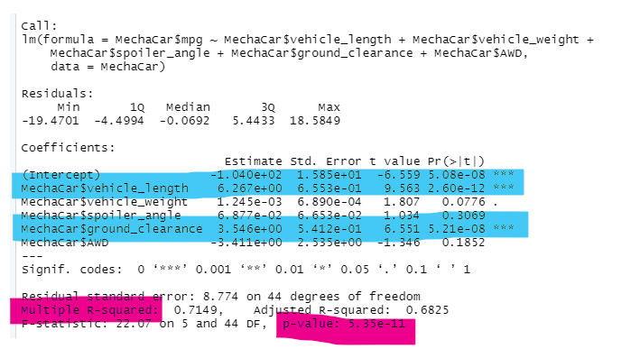
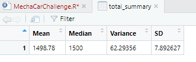
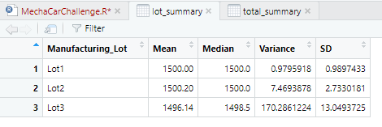
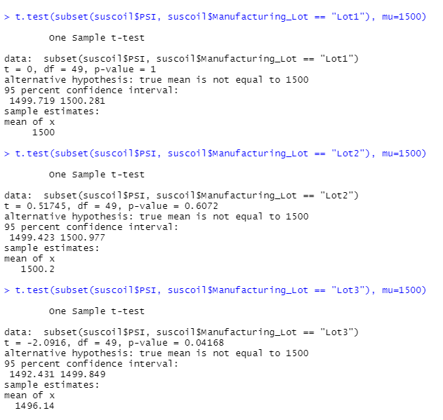

# MechaCar_Statistical_Analysis
Unit 15 Challenge

## Overview of MechaCar Statistical Analysis Project
Analysis performed on behalf of customer AutosRUs in order to identify potential causes of production difficulties.
Stated project goals include:
- identify predictive variables for MPG
- summarize variables of PSI on suspension coils
- identify any statistically significant differences between manufacturing lots
- plan for future analysis comparing MechaCar performance against other manufacturer products

## Linear Regression as Predictor of MPG

A summary of the linear progression performed on the MPG information provided is shown above.

### Which variables/coefficients provided a non-random amount of variance to the mpg values in the dataset?
Highlighted in blue are the two variables that showed the most significant (i.e. non-random) effect: vehicle length and vehicle ground clearance. 
It is important to note that the intercept also shows as significant (on the line above the vehicle length), indicating that other variables outside those considered in the analysis may have impacted vehicle gas mileage.

### Is the slope of the linear model considered to be zero? Why or why not?
The null hypothesis can be rejected, as the p-value shows at 5.35X10-11 (shown in pink above). A p-value at this level indicates that there is a relationship between the variables being considered and vehicle gas mileage beyond just random happenstance.

### Does this linear model predict mpg of MechaCar prototypes effectively? Why or why not?
An r-squared value of .7149 indicates that this particular analysis will accurately predict performance about 70% of the time. It's effectiveness as a predictor may be tightened up by adding in further variables, as the linear progression above indicates that other variables seem to have an effect.

## Summary Statistics on Suspension Coils

Customer information notes that variance in suspension coils must not exceed 100 pounds per square inch. While the top statistical summary shows that overall, performance does not exceed that variance, the breakdown of statistics by lots shows that Lot 3 reached a significantly unacceptable variance level of more than 170 pounds per square inch. 

## T-Tests on Suspension Coils

An examination of a t-test on the overall data shows that the p-value (0.06028) is greater than our assumed significance level (0.05). This means that the PSI across all lots is statistically similar to the mean of 1500 PSI.

Since a summary of suspension coil performance by lot was performed and demonstrated a difference across lots, it is important to examine T-test results across lots. The results of each t-test are shown above.

Lot 1 has a p-value of 1, which means that the values are exactly the same as the assumed population mean of 1500 PSI. Lot 2's p-value of 0.6072 is greater than our assumed significance level of 0.05, which means that it is statisically similar to the mean of 1500 PSI. 

However, Lot 3 has a p-value of 0.04168, which is too small to allow us to reject our null hypothesis. Therefore, the PSI for manufacturing Lot 3 is NOT statistically similar to the mean of 1500 PSI.

## Study Design: MechaCar vs Competition

The final portion of the task is to design a statistical study in order to quantify MechaCar performance versus that of a competitor. 

### Metric
Fuel efficiency was a main focus of this particular internal analysis, and is one important factor when consumers make vehicle purchasing decisions. While fuel efficiency affects the cost of vehicle usage on an ongoing basis, another important cost factor is the overall retail price of the vehicle versus competitors. As such, fuel efficiency and vehicle cost will be the metrics used in the study of the MechaCar against its competitors.

### Null/Alternative Hypothesis
In this analysis, the null hypothesis will be that the cost and fuel efficiency of all vehicles in the MechaCar's class are equal. The alternative hypothesis will be that at least one vehicle in the class has a different mean fuel efficiency or cost than the others.

### Statistical Test
An analysis of variance will be used to compare the means across multiple groups as a continuous numerical variable. In addition to the one-way test of variance for cost, a two-way test of variance will be used for fuel efficiency in order to compensate for the additional factors of city vs. highway measurements.

### Data Set
In order to complete the analysis, a sample of 100 cars from MechaCar as well as 5 competitors will be used, meaning a total of 500 vehicles. For each car, the overall cost, the average mpg, city mpg, and highway mpg will be used.
